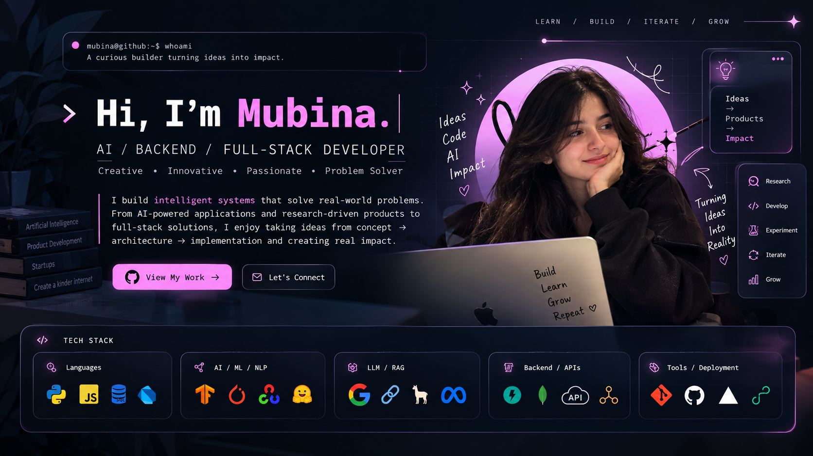

<div align="center">



</div>

<div align="center">

### AI • Backend • Full-Stack • Product Engineering

Building intelligent systems that solve real-world problems.

</div>

---

## About Me

I'm a final-year Computer Engineering student and builder working at the intersection of **Artificial Intelligence, backend engineering, APIs, and product development**.

I enjoy taking ideas from **concept → architecture → implementation → impact**, especially when the solution involves AI, automation, research, or data.

My recent work spans **LLM applications, RAG pipelines, semantic search, NLP, machine learning, computer vision, decision-support systems, and full-stack products**.

> **Learn / Build / Iterate / Grow.**

---

## What I Build

| Area | What I work with |
|---|---|
| 🤖 AI Engineering | LLM applications, AI agents, prompt engineering, AI product workflows |
| 🧠 RAG & Search | Embeddings, semantic search, vector retrieval, FAISS, document pipelines |
| 📊 Machine Learning | Classification, regression, XGBoost, model evaluation, prediction systems |
| 💬 NLP | Text processing, BERT, spaCy, LLM-powered research and validation |
| 👁️ Computer Vision | OpenCV, MediaPipe, CNNs, image processing |
| ⚙️ Backend | Python, FastAPI, REST APIs, caching, data pipelines |
| 🔌 API Engineering | Gemini, Tavily, NewsData, Google Sheets and other third-party integrations |
| 🗄️ Data | MongoDB, vector stores, structured datasets |
| 🚀 Product Engineering | Full-stack applications, startup prototypes, AI-native tools |
| ☁️ Deployment | Git, GitHub, Vercel, Render, WSL, npm, pnpm |

---

## Tech Stack

**Languages**

`Python` `JavaScript` `SQL` `Dart`

**AI / ML / NLP**

`TensorFlow` `Keras` `PyTorch` `XGBoost` `OpenCV` `BERT` `spaCy` `MediaPipe` `NumPy` `PIL`

**LLMs / RAG / Search**

`Gemini` `LangChain` `FAISS` `Embeddings` `Semantic Search` `RAG` `Prompt Engineering` `AI Agents`

**Backend / APIs**

`FastAPI` `REST APIs` `MongoDB` `API Integration` `Caching` `Data Pipelines`

**External APIs & Data Sources**

`Gemini API` `Tavily API` `NewsData API` `Google Sheets API` `Clustro AI API`

**Deployment / Tools**

`Git` `GitHub` `Vercel` `Render` `WSL` `npm` `pnpm`

---

## Selected Projects

### ◈ Cofoundr OS — AI Co-Founder

An AI-native company-building operating system designed around persistent company context and intelligent decision support.

**Core systems**

- Conversational startup onboarding
- Persistent company memory
- RAG-powered knowledge retrieval
- Semantic document search
- AI co-founder chat
- Startup health analysis
- Competitor intelligence
- Decision simulation
- Market and news research
- ML-based prediction

**Stack:** `Python` `FastAPI` `MongoDB` `FAISS` `Gemini` `LangChain` `XGBoost` `APIs`

---

### ◈ Startup Idea Validator

An NLP-focused research system for investigating startup ideas, existing products, competitors, market signals, and relevant information sources.

**Focus:** `NLP` `LLMs` `Semantic Search` `Research Automation` `APIs`

---

### ◈ Decision Simulator

A company-context-first decision system that combines internal company knowledge with external intelligence.

```text
Decision
   ↓
Investigate
   ↓
Company Context + Market + News + Competitors
   ↓
Structure
   ↓
Predict
   ↓
Explain
   ↓
Compare
   ↓
Decide
   ↓
Act
   ↓
Learn
```

---

### ◈ Image Colorization

A computer-vision project for adding color to grayscale images using deep learning.

**Stack:** `Python` `OpenCV` `TensorFlow` `Keras` `CNN`

---

### ◈ ISL Translation System

A sign-language translation application using computer vision and machine-learning techniques to interpret Indian Sign Language gestures.

**Stack:** `Python` `OpenCV` `MediaPipe` `Deep Learning`

---

## Engineering Interests

```text
Artificial Intelligence
Generative AI
Large Language Models
RAG Systems
Semantic Search
Machine Learning
Natural Language Processing
Computer Vision
Backend Engineering
API Architecture
Full-Stack Development
AI Product Development
Startup Technology
```

---

## GitHub Activity

<div align="center">


</div>

---

<div align="center">

### Turning ideas into intelligent products.

</div>
